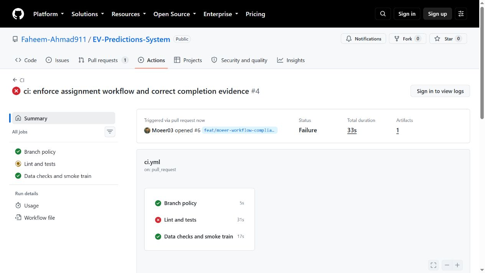
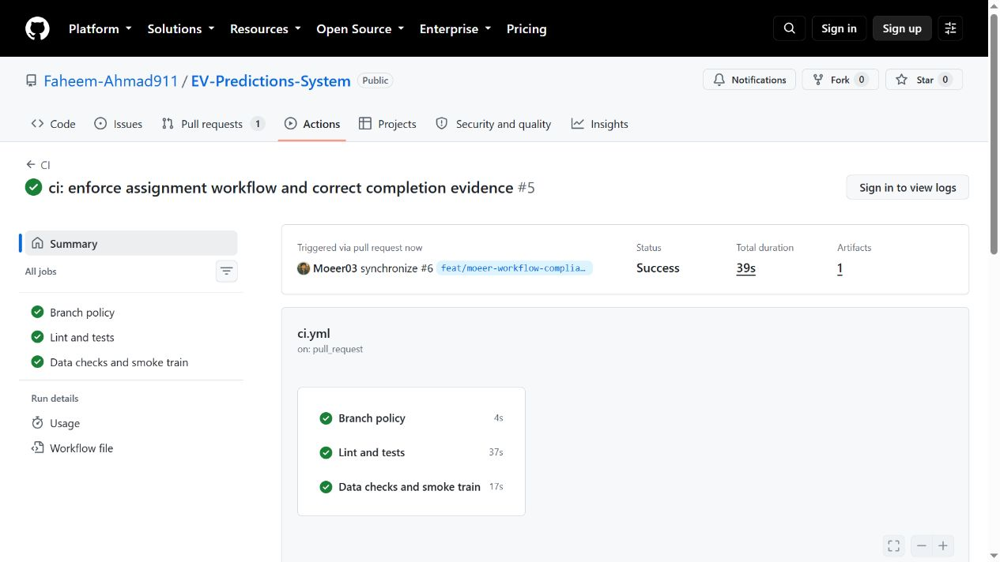

# Workflow correction evidence

The compliance feature branch starts from dev at ccdcd63. It adds Branch policy,
release-file checks and actual guardrail commit probes, and corrects the report.

All historical route mistakes are preserved in REPORT.md. Branch protection is
still an owner action, so a failed CI run alone is not proof that merging is blocked.

Local checks: all 36 tests, including 15 policy regression tests, passed. Ruff,
formatting and all pre-commit checks passed. The guardrail command attempted
real commits in a temporary repository; a 5 MB file and deliberately invalid
private-key fixture were both rejected. No fixture commit reached history.

## Actual GitHub CI demonstration

[PR #6](https://github.com/Faheem-Ahmad911/EV-Predictions-System/pull/6)
targets dev and is authored by Moeer03.

- [Failed run 37115058242](https://github.com/Faheem-Ahmad911/EV-Predictions-System/actions/runs/37115058242)
  at d2b4279: 1 intentionally failing test and 36 passing tests. The temporary
  test explicitly identified itself as the assignment demonstration.
- Commit 7a56870 removed that intentional failure.
- [Passing run 37115134354](https://github.com/Faheem-Ahmad911/EV-Predictions-System/actions/runs/37115134354)
  at 7a56870: Branch policy, Lint and tests, and Data checks and smoke train
  all passed. The suite reported 36 passed.
- [Guardrail log excerpts](ci-guardrails.txt) are verbatim matching lines from
  that successful run, including timestamps. They show actual 5 MB and fake-key
  commit rejections. The temporary repository never acquired a fixture commit.

These screenshots were captured from the actual GitHub run pages. They are CI
demonstrations, not dataset results. Capturing the hook-log screenshot from a
signed-in Actions view remains pending; the public browser requires sign-in to
view logs. The authenticated CLI provided the log excerpts above.

